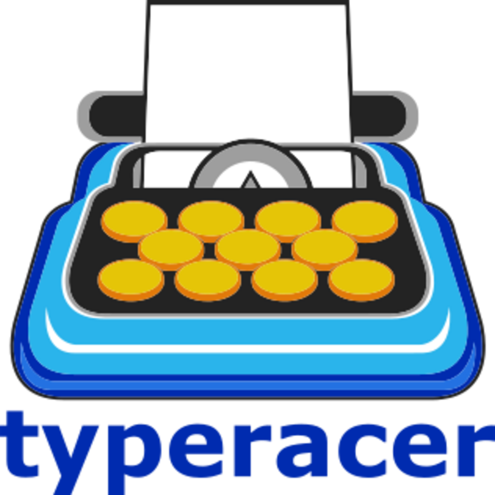

<h1 align="center">Hi 👋, I'm Abdallah Mahmoud Ramadan</h1>
<h3 align="center">An enthusiastic Android Developer from Egypt 🇪🇬</h3>

# ✨ <strong>About Me</strong> ✨

<em>A quick look at me</em>

- 📱 Passionate about building modern Android apps using Kotlin and Jetpack Compose.
- :school: `Student` at the [Faculty of Computers & Informatics](https://www.svu.edu.eg/faculties/fci/en/home-page-en/) - [South Valley University](https://www.svu.edu.eg/ar/).
- :technologist: I love using Software to solve every `Problem`.
- :computer: I am a competitive programmer at [Codeforces](https://codeforces.com/profile/Abdallah_Alqiran) and [LeetCode](https://leetcode.com/u/Abdallah_Alqiran/).
- 🔥solving problems using `C++` and `Kotlin`.
- :student: Currently dive in Android development with `Kotlin`.
- 💪🏿Developing strong and scalable applications while tackling technical challenges.
- 🏅 Participated in the ECPC qualification two times.
- 💼 Actively seeking `job opportunities`  
  📄 [View My CV](https://drive.google.com/drive/folders/1H3fWSC_sh6Sic_gVzc5DmiTSNDd0pXvx) | 🌐 [Visit My Portfolio](https://abdallah-alqiran.github.io/web-portfolio/)

# 🚀 <strong>Skills</strong> 🚀

<em>What I use to build, solve, and explore</em>

## 🧾 Programming Languages

  <!-- Kotlin -->
  
  <!-- Dart -->
  
  <!-- C++ -->
  
  <!-- HTML5 -->
  
  <!-- CSS3 -->
  
  <!-- JavaScript -->
  
  <!-- PHP -->
  
  <!-- Stack overflow -->

## 🛠️ Technologies & Tools

  <!-- Android Studio -->
  
  <!-- VS Code -->
  
  <!-- Jetpack Compose -->
  
  <!-- Flutter -->
  
  <!-- Laravel -->
  
  <!-- Firebase -->
  
  <!-- Git -->
  
  <!-- GitHub -->
  
  <!-- Postman -->
  
  <!-- Notion -->
  
  <!-- Figma -->
  
  <!-- Stack Overflow -->
  

## ⚔️ Competitive Programming Profiles

  <!-- Codeforces -->
  
  <!-- LeetCode -->
  

##  Connect with me

    <!-- Email -->
	
    <!-- Linked in -->
	
    <!-- Whats app -->
	

## 🖥️ Operating Systems

  <!-- Windows -->
  
  <!-- Linux -->
  

## 🌍 Languages

  <!-- Arabic -->
  
  <!-- English -->
  

## ⌨️ Typing Skill

<!-- Type Racer -->

<!-- Monkey Type -->

 <h3 align="left">🏆 GitHub Trophies:</h3>
  

      
  

